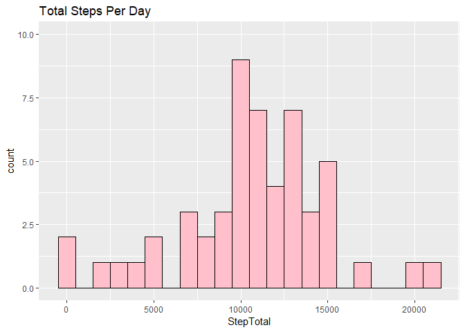
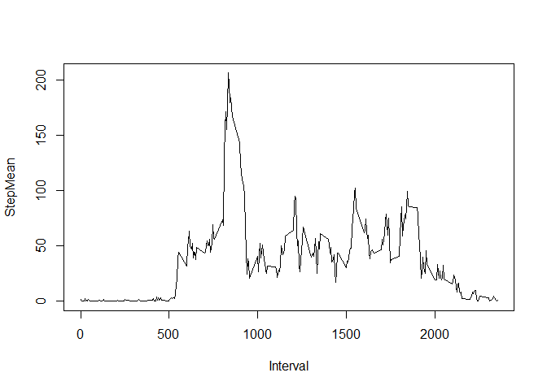

Reproducible Research Project 1
================

Introducing the Project
-----------------------

In this project, we will be analyzing an anonymous individual's walking routine over the following time interval: **October 1st 2012 - November 30th 2012**. Specifically, we will assess the number of steps taken over five minute interval measurements.

Task 1: Reading the CSV file
----------------------------

The "activity.csv" file that was provided by Coursera is already relatively easy to work with. I created the following function to read the file into my workspace:

``` r
#set appropriate working directory (location depends on individual)
setwd("~/R Material/Coursera/Course 5 Reproducible Research/Week 1/repdata_data_activity")
#Activate dplyr
library(dplyr)
```

    ## 
    ## Attaching package: 'dplyr'

    ## The following objects are masked from 'package:stats':
    ## 
    ##     filter, lag

    ## The following objects are masked from 'package:base':
    ## 
    ##     intersect, setdiff, setequal, union

``` r
#Read in csv file, cleaning up column names and coercing 2nd column into a Date class
ReadFile <- function(){
      return(read.csv("activity.csv", colClasses = c("integer","Date", "integer"),
                      col.names = c("Steps", "Date", "Interval")))
}

ActivityFile <- ReadFile()
head(ActivityFile)
```

    ##   Steps       Date Interval
    ## 1    NA 2012-10-01        0
    ## 2    NA 2012-10-01        5
    ## 3    NA 2012-10-01       10
    ## 4    NA 2012-10-01       15
    ## 5    NA 2012-10-01       20
    ## 6    NA 2012-10-01       25

Before moving onto the assignment questions, we will look at a summary of the data table

``` r
summary(ActivityFile)
```

    ##      Steps             Date               Interval     
    ##  Min.   :  0.00   Min.   :2012-10-01   Min.   :   0.0  
    ##  1st Qu.:  0.00   1st Qu.:2012-10-16   1st Qu.: 588.8  
    ##  Median :  0.00   Median :2012-10-31   Median :1177.5  
    ##  Mean   : 37.38   Mean   :2012-10-31   Mean   :1177.5  
    ##  3rd Qu.: 12.00   3rd Qu.:2012-11-15   3rd Qu.:1766.2  
    ##  Max.   :806.00   Max.   :2012-11-30   Max.   :2355.0  
    ##  NA's   :2304

There are 2304 NA values for the Steps column, so we will keep this in mind when we move forward with the analysis.

Task 2: Create histogram for the total number of steps per day
--------------------------------------------------------------

For this calculation, we will ignore rows containing NA values. Using the cleaned ActivityFile data table as an *arguement*, I created two functions to first calcuate the total steps per day, and then create a histogram representation.

``` r
#Function takes our ActivityFile data table as an arguement to calculate total steps/day
StepSumPerDay <- function(ActivityFrame){
      #filter out rows with NA values, group by Day, and then calculate sum per day
      ActivityFrame <- filter(ActivityFrame, is.na(Steps) == FALSE) %>% group_by(Date) %>%
            summarise(sum(Steps))
      #Clean up variable names
      names(ActivityFrame) <- c("Date", "StepTotal")
      ActivityFrame
}
```

When I call this function we will get the appropriate table of **total steps per day**

``` r
TotalStep <- StepSumPerDay(ActivityFile)
head(TotalStep)
```

    ## # A tibble: 6 x 2
    ##   Date       StepTotal
    ##   <date>         <int>
    ## 1 2012-10-02       126
    ## 2 2012-10-03     11352
    ## 3 2012-10-04     12116
    ## 4 2012-10-05     13294
    ## 5 2012-10-06     15420
    ## 6 2012-10-07     11015

I then created a function that takes the "Steps" column variable (from TotalStep) and plotted a histogram spread, utilizing the ggplot2 package

``` r
library(ggplot2)
StepTotalHist <- function(StepTotalFrame){
      g <- ggplot(data = StepTotalFrame, aes(StepTotal)) +
            geom_histogram(binwidth = 1000, color = "black", fill = "pink") + ggtitle("Total Steps Per Day") + ylim(0,10)
      return(g)
}

HistogramStepTotal <- StepTotalHist(TotalStep)
print(HistogramStepTotal)
```



Task 3: Determine the mean and median values for steps/day
----------------------------------------------------------

For this task, I created two simple functions.

``` r
CalculateMean <- function(StepVector){
      MeanSteps <- mean(StepVector)
}

print(paste("Mean Steps/Day:", StepMean <- CalculateMean(TotalStep$StepTotal)))
```

    ## [1] "Mean Steps/Day: 10766.1886792453"

``` r
CalculateMedian <- function(StepVector){
      MedianSteps <- median(StepVector)
}


print(paste("Median Steps/Day:" , StepMedian <- CalculateMedian(TotalStep$StepTotal)))
```

    ## [1] "Median Steps/Day: 10765"

Task 4: Create a time-series plot of the average number of steps taken, across all days
---------------------------------------------------------------------------------------

We will go back to using our original ActivityFile data table for this task. I created a function to perform tasks that are similar to what was done for task 2. The difference is that we need to group by interval and take an average value.

``` r
AvgStepsPerInterval <- function(ActivityFrame){
      ActivityFrame <- filter(ActivityFrame, is.na(Steps) == FALSE) %>%
            group_by(Interval) %>%summarise(mean(Steps))
      
      names(ActivityFrame) <- c("Interval", "StepMean")
      ActivityFrame
}

MeanStepPerInterval <- AvgStepsPerInterval(ActivityFile)
head(MeanStepPerInterval)
```

    ## # A tibble: 6 x 2
    ##   Interval StepMean
    ##      <int>    <dbl>
    ## 1        0   1.72  
    ## 2        5   0.340 
    ## 3       10   0.132 
    ## 4       15   0.151 
    ## 5       20   0.0755
    ## 6       25   2.09

Using the time interval as th x-variable and the mean steps as the y-variable, we will create a time-series plot (type = "l").

``` r
with(MeanStepPerInterval, plot(Interval, StepMean, type = "l"))
```



Task 5: Find the time interval with the higest average step value
=================================================================

``` r
print(MeanStepPerInterval[which.max(MeanStepPerInterval$StepMean),])
```

    ## # A tibble: 1 x 2
    ##   Interval StepMean
    ##      <int>    <dbl>
    ## 1      835     206.
